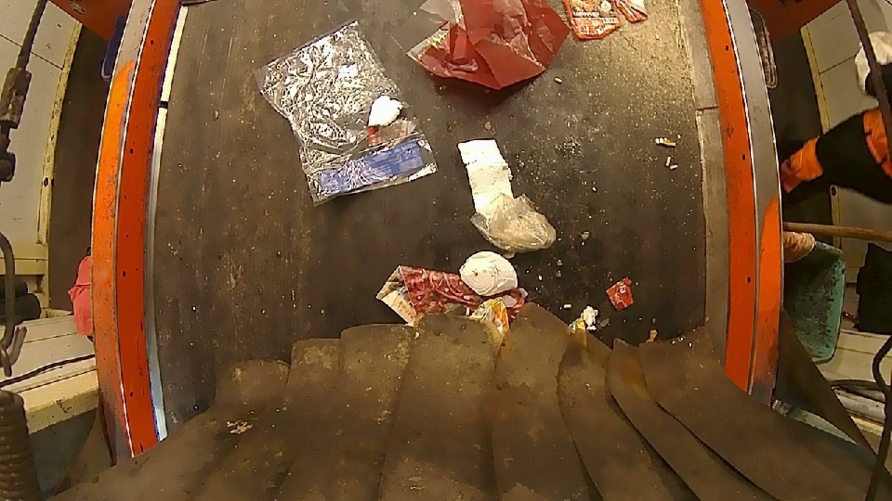

# Video Annotation

> An automated Video annotation tool built with Python + OpenCV for object detection in YOLO format




### Description

The provided solution is a video annotation tool, written in Python 3, leveraging the OpenCV library. The primary objective of this tool is to annotate objects in video frames. The annotations are saved in the YOLO (You Only Look Once) format, a popular format for object detection tasks.

The tool begins by checking the version of OpenCV and sets the relevant flags accordingly. It then retrieves the video file path from command-line arguments or uses a default path if no argument is provided. The tool will terminate if neither is provided.

For organizational purposes, the tool creates a set of directories to store different kinds of output, namely, labels, JPEG images, ground truth, and augmented images.

The main functionality of the tool involves defining a set of mouse and keyboard interactions to create, adjust, and delete bounding boxes around objects in video frames. There are also provisions to skip frames and change the class of the annotated object. 

The tool displays the annotated video using OpenCV's imshow function. For each frame, a set of interactions are defined:

- Mouse events for drawing and adjusting bounding boxes.
- Keyboard events for various functions like skipping frames, modifying bounding boxes, changing the object's class, saving, etc.

Once a frame is annotated, pressing the spacebar saves the annotation in the YOLO format.

An additional function, `imview()`, is provided to draw bounding boxes around annotated objects in a standalone image using YOLO-format annotations.

### Evaluation

The solution provides robust functionality for video annotation tasks. It utilizes the mouse and keyboard effectively to interact with video frames and draw bounding boxes. However, the solution might appear quite complex, especially to a new user due to the numerous keyboard shortcuts. As such, a dedicated user interface or a help guide may improve the user experience.

The solution could be more effective by handling edge cases more gracefully, for instance, when video frames are too small for annotation or when the video file doesn't exist or cannot be read. It could also benefit from validating and normalizing bounding box coordinates to prevent issues with out-of-bounds or negative values.

It should be noted that the effectiveness of this tool largely depends on the complexity and nature of the video to be annotated, as well as the user's familiarity with the tool.

### Justification for Implementation

While there may be other approaches to video annotation, the present implementation offers some compelling advantages:

1. **Flexibility**: The tool is versatile, allowing for a wide range of interactions, including drawing, adjusting, and deleting bounding boxes, as well as changing the object's class.
2. **Interactivity**: The tool allows real-time interaction with the video, making the annotation process more intuitive than static methods.
3. **Efficiency**: The tool supports shortcuts for common actions, which can speed up the annotation process significantly once the user is familiar with them.
4. **Format Compatibility**: The tool saves annotations in the widely-used YOLO format, making the output readily usable in many object detection frameworks.
5. **Scalability**: The tool works with videos of any size and can handle multiple annotations per frame. This makes it scalable for larger, more complex annotation tasks.


## Limitations

While this Python-based Video Annotation tool is designed to be robust and efficient, there are some inherent limitations that should be considered:

1. **No Visualization of Saved Annotations**: The tool currently saves the annotations made, but it does not offer an option to save the video with the bounding boxes (annotations) drawn on it. Therefore, users cannot review their annotations on the video directly within the program. To visualize the annotations, users will have to write additional code to load the annotations and draw the rectangles on the frames.

2. **Limited Annotation Format Support**: The program saves annotations only in the YOLO format. This limits its use to users and systems that can interpret this specific format. While YOLO is a popular format, it might not be universally acceptable in all use cases.

3. **Manual Navigation Required**: Users need to manually navigate through the frames using the 'SkipFrames' trackbar. Automatic, customizable frame skipping or smooth frame scrolling is currently not available, which might slow down the annotation process in case of lengthy videos.

4. **Single Class of Object Recognition**: The tool changes the color of the annotation box based on the object's class. However, it does not provide an in-built system to recognize multiple classes of objects within a single frame. Therefore, if multiple classes of objects need to be annotated within a frame, the user has to manually change the class ID for each annotation, which can be tedious.

5. **No Undo Function for Individual Changes**: While the tool allows for the resetting of a frame to its original state, it does not offer an 'undo' function for individual changes. If a user makes an error in annotation, they cannot undo the last change but have to reset the entire frame and start from scratch. This can potentially slow down the annotation process.

6. **No AI-Assisted Annotation**: The application relies completely on manual annotation. It lacks AI-assisted features like automatic object detection and tracking, which are commonly found in more sophisticated video annotation tools.

7. **Dependence on Exact File Path**: The application expects the video file to be in the exact same directory as the script, which might be inconvenient for users who manage videos and scripts in separate directories.

These limitations, however, represent opportunities for further enhancement and development of the tool. Future versions can look into addressing these limitations to provide an even more robust and user-friendly video annotation experience.

## Output Example

> [See example outputs here](https://drive.google.com/drive/folders/1_tuHCG1-FaILKHlld1vhJ5f-QzRx-Vov?usp=sharing)

## Installation (Tested with Python 3.8 and OpenCV 4.5.2)
### **NB: You will need OpenCV with ffmpeg lib**

```sh
You will need OpenCV with ffmpeg lib

conda create -n videoannotation python=3.8
conda activate videoannotation
conda install -c menpo opencv
pip install --upgrade pip 
pip install opencv-contrib-python

```

## Run with Docker 
### Ubuntu Version: 20.04 / Python 3.8 / OpenCV 4.5.2

 0. You need to install [Docker](https://docs.docker.com/install/) and clone this [project](https://github.com/chinesefirewall/automated_video_annotation_system).
 
 1. Build the docker image. This command only needs to be run once.
			
		docker build . -t "videoAnnotation:core"
 
 2. Make the display exportable

		xhost +local:root

 3. Run and have fun!
	
		docker run -it --rm -e DISPLAY=${DISPLAY} -e QT_X11_NO_MITSHM=1 -v /tmp/.X11-unix:/tmp/.X11-unix videoannotation:core

 4. To pass data through container -> PC host

 		docker cp <ContainerDockerNumber>:/app/ .

 5. To pass data through PC host -> container (Pass video file to container)

 		docker cp <dataPathInHostPc> <ContainerDockerNumber>:/app/


## Usage example

```sh
python videoAnnotation.py Sorting_Recording.mp4
```

## Controls:

* q - Quit
* Mouse Left - Create new BoundBox, drag to change the dimension
* Mouse Right - Erase actual BoundingBox
* WASD - Move the BoundBox
* 8456 - Change width and height
* Space - Next frame
* Z - Previous 
* 79 - Change current bound box
* '/' or '*' - Change current class
* '-' - Delete the bound box
* R - Get bound box from labels.txt

## Variables -- Trackbar

* ID - Id of the label
* Jump - How many pixels WASD/8456 will change
* Skip - How many frames will be skipped

## Directory Structure
Given a video file, it will create:

```
.
└── VideoFolder (The same name of the video file)
    ├── Ground  (Fold of ground images with BoundBox)
    ├── JPEGImages (Fold of images without BoundBox)
    ├── labels (Fold with the .txt labels files in YOLO format)
 	└──	imgList.txt (List with full directory of images inside JPEGImages folder)
```

### Label Format

    (ID) (absoluteX/imgWidth) (absoluteY/imgHeight) (absoluteWidth/imgWidth) (absoluteHeight/imgHeight)

    Example: 
	  Class Id = 0
	  absoluteX = 50  (X of the center of the BoundBox)
	  absoluteY = 50  (Y of the center of the BoundBox)
	  absoluteWidth = 100 (Width of the BoundBox)
	  absoluteHeight = 100 (Height of the BoundBox)
	  imgWidth = 400  (Image width)
	  imgHeight = 400 (Image Height)

	         0 50/400 50/400 100/400 100/400
	  Label: 0 0.125  0.125   0.25    0.25
	

### TODO
	
	1. Organize the code better.
	2. Make automatic BoundBox.
	3. A prettier GUI.
	4. Make a better Documentation using confluence or notion, etc.
	5. Wrap the code in OOP method to make it more maintainable and modular.

### Please Feel Free to Contact Me!

**Niyi Adebayo** ([GitHub](https://github.com/chinesefirewall/automated_video_annotation_system))
**adebayoniyi2000@yahoo.com**
